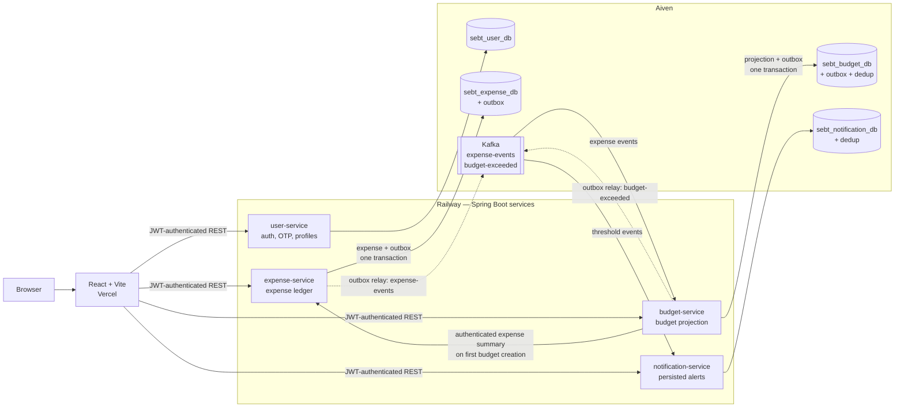
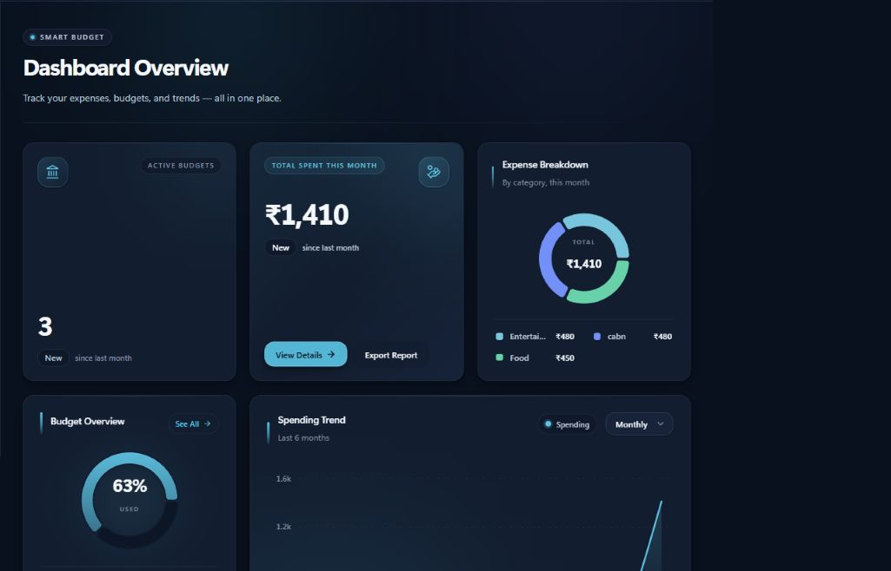
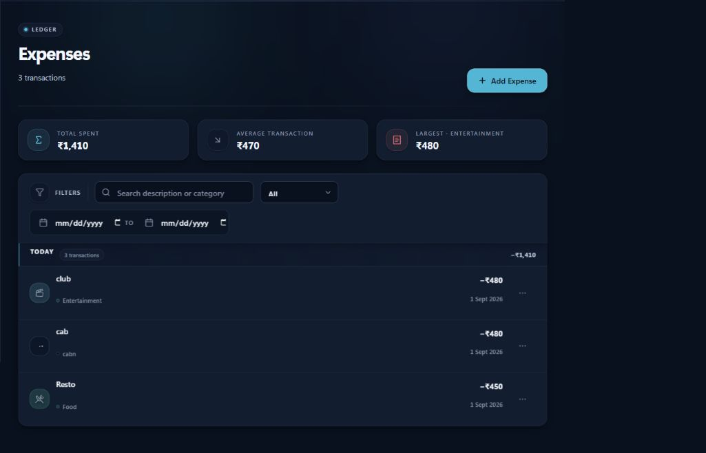
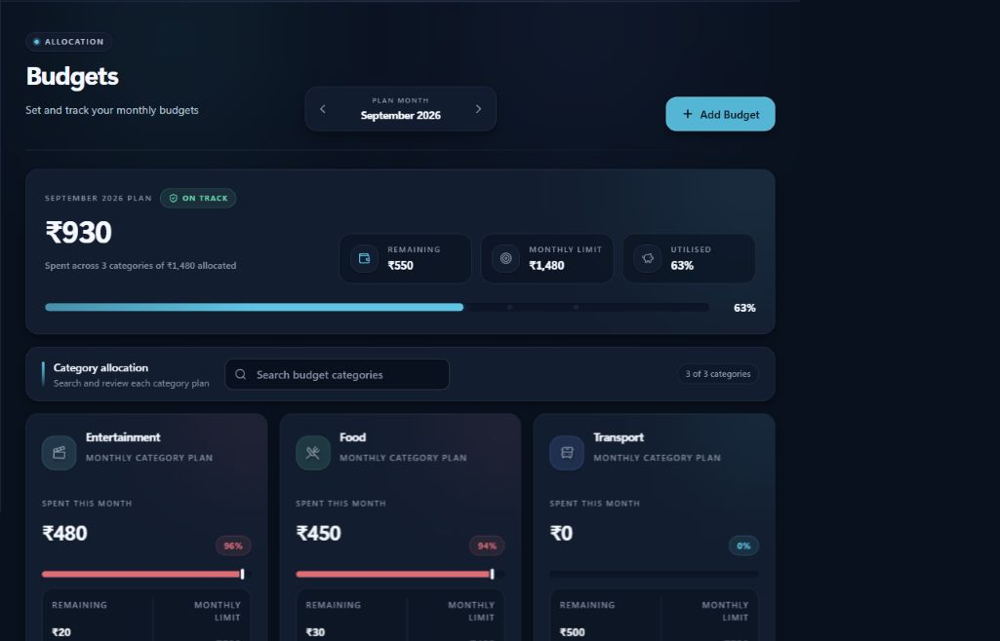

# Smart Expense & Budget Tracker

A full-stack personal-finance platform built around event-driven Spring Boot microservices, reliable Kafka delivery, and a responsive React interface.

[](https://smart-expense-budget-tracker-lake.vercel.app)
[](https://github.com/Ayush-Raj178/smart-expense-budget-tracker/actions/workflows/ci.yml)

**Live application:** [https://smart-expense-budget-tracker-lake.vercel.app](https://smart-expense-budget-tracker-lake.vercel.app)

SmartBudget supports authenticated expense tracking, monthly category budgets, spending projections, threshold notifications, password recovery, and profile management. It is designed as an engineering portfolio project: the service boundaries, failure handling, deployment tradeoffs, and consistency model are as important as the user-facing features.

## What this project demonstrates

- **Event-driven microservices:** four independently deployable Spring Boot services own separate MySQL schemas and communicate through REST at the application boundary and Kafka for expense-to-budget-to-notification propagation.
- **Reliable event publication:** expense and budget mutations use transactional outboxes, acknowledgement-aware relays, exponential retry scheduling, and explicit `PENDING` / `PUBLISHED` / `FAILED` states to close the database/Kafka dual-write gap.
- **Idempotent Kafka consumers:** event UUIDs are recorded in `processed_events` within the same local transaction as each projection update; malformed records are handled through `ErrorHandlingDeserializer` and dead-letter topics.
- **Real authentication workflows:** stateless JWT authorization, BCrypt password and OTP hashing, challenge expiry, resend cooldowns, attempt limits, MX-domain checks, anti-enumerating password recovery, and verified email changes are implemented in the user service.
- **A documented design system:** the research-driven Graphite Ledger interaction language and Ivory Ledger / Mulberry Ink palettes cover semantic tokens, contrast, responsive layouts, reduced motion, dense financial hierarchy, and reusable UI primitives.
- **Automated delivery checks:** GitHub Actions runs all four Maven test suites plus frontend lint and production-build verification on pushes and pull requests to `main`; Vercel and Railway manage deployment outside the workflow.

## Architecture



Most backend propagation is asynchronous. The deliberate exception is budget creation: budget-service calls the authenticated expense summary endpoint once to initialize `currentSpent` from expenses that already exist for that category and month. The frontend calls each service directly; there is no hidden monolith or shared application database.

## Tech stack

| Area | Technologies | Role in the system |
|---|---|---|
| Backend | Java 17, Spring Boot 3.2.5, Spring Web, Spring Security, Spring Data JPA, Spring Validation, Actuator | REST services, authorization, business rules, persistence, health checks |
| Authentication | JJWT 0.12.5, BCrypt, Spring Mail, JNDI DNS | JWT issuance/validation, password and OTP hashing, SMTP delivery, MX-domain validation |
| Messaging | Apache Kafka, Spring Kafka, JSON events | Asynchronous projection updates, threshold events, DLT routing |
| Data | MySQL 8, one schema per service | Service-owned persistence, outboxes, idempotency records |
| Frontend | React 19, Vite 8, React Router 7, Axios | SPA shell, routing, authenticated API access |
| UI and visualization | Tailwind CSS 3, Framer Motion, Recharts, Lucide React | Responsive design system, reduced-motion-aware interaction, financial charts |
| Local infrastructure | Docker Compose, multi-stage service Dockerfiles, Kafka KRaft mode | Reproducible MySQL, Kafka, and four-service environment |
| CI/CD | GitHub Actions, Vercel, Railway | Backend test matrix, frontend lint/build gate, hosted frontend and services |
| Managed cloud | Aiven MySQL and Kafka | Live persistence and event transport |

## Live deployment notes

The public deployment is intentionally budget-conscious: Vercel hosts the frontend, Railway hosts all four backend services, and Aiven supplies MySQL and Kafka on free tiers. That choice keeps the complete distributed architecture visible without pretending that free infrastructure has production-grade capacity or availability.

- **Email OTP is disabled only in the live demo.** Free application-hosting tiers restrict the SMTP ports required by the mail flow, so Railway sets `OTP_VERIFICATION_ENABLED=false`. Live signup creates an account directly; password reset and email change are unavailable. Docker Compose defaults the flag to `true`, where the complete email-verification, recovery, and email-change flows remain implemented and testable with SMTP credentials.
- **Public-network latency required different timeouts.** The budget backfill client uses 500 ms connect / 1000 ms read timeouts on the local Docker network. Those values were too aggressive between public Railway service origins and initially caused the two backfill attempts to fall back to zero. Production now uses 3000 ms / 5000 ms.
- **Cold starts are possible.** The first request to a sleeping free-tier service may take noticeably longer than normal. The initial dashboard load fans out to multiple services, so allowing them time to wake is expected behavior for this deployment tier.
- **The tradeoff is financial, not architectural.** The same four services, event contracts, outbox relays, schema boundaries, and Kafka consumers run locally and in the cloud; only email-dependent behavior and latency settings differ.

## Run locally

### Prerequisites

- Docker Desktop with Docker Compose
- Node.js 22 and npm
- Optional: Gmail-compatible SMTP credentials to exercise the full OTP flows

### 1. Clone and configure

```bash
git clone https://github.com/Ayush-Raj178/smart-expense-budget-tracker.git
cd smart-expense-budget-tracker
cp .env.example .env
```

PowerShell equivalent for the last command:

```powershell
Copy-Item .env.example .env
```

At minimum, replace `MYSQL_ROOT_PASSWORD` and `JWT_SECRET` in `.env`. Use a random JWT secret of at least 64 characters. To test signup verification, password recovery, and email changes, also set `SMTP_USERNAME`, `SMTP_PASSWORD`, and `MAIL_FROM` to valid SMTP credentials. `OTP_VERIFICATION_ENABLED` defaults to `true` locally; add `OTP_VERIFICATION_ENABLED=false` to `.env` only if you want the simplified no-SMTP signup mode.

### 2. Start MySQL, Kafka, and the four backend services

```bash
docker compose up -d --build
docker compose ps
```

Wait until the service health checks pass. The local endpoints are:

| Service | URL |
|---|---|
| user-service | `http://localhost:8081` |
| expense-service | `http://localhost:8082` |
| budget-service | `http://localhost:8083` |
| notification-service | `http://localhost:8084` |

### 3. Start the frontend

```bash
cd frontend
npm install
npm run dev
```

Open [http://localhost:5173](http://localhost:5173). Vite proxies the application APIs to ports 8081–8084.

To stop the backend stack without deleting its named volumes:

```bash
docker compose down
```

## Key engineering challenges solved

| Challenge | Failure mode | Implemented resolution |
|---|---|---|
| Database/Kafka dual writes | A database commit could succeed while Kafka publication failed, leaving downstream projections permanently stale. | The expense and budget services commit business data and a `PENDING` outbox row atomically. Relays publish later, wait for broker acknowledgement, retry with exponential backoff, and retain terminal failures for inspection. Delivery is at least once. |
| Duplicate delivery after relay crashes | A relay can publish successfully and crash before marking the outbox row `PUBLISHED`, causing the event to be sent again. | Consumers use the event UUID as the `processed_events` primary key and commit deduplication with the business update in one transaction. |
| Kafka poison pills | Deserialization failures can occur before listener code and repeatedly block a partition. | `ErrorHandlingDeserializer` surfaces malformed records to `DeadLetterPublishingRecoverer`, which routes them to topic-specific `.DLT` topics with source offset logging. |
| Incorrect budget totals after expense edits | Earlier update events lacked the old category/month, so moving an expense could debit or credit the wrong projection. | `ExpenseUpdated` now carries old and new amount, category, and date. budget-service reverses the old bucket and applies the new bucket, with same-bucket, cross-category, cross-month, and combined tests. |
| Budget backfill worked locally but returned zero in cloud | Local-network timeouts expired between public Railway origins, exhausting both summary attempts and activating the client's zero fallback. | Production connect/read timeouts were raised from 500/1000 ms to 3000/5000 ms after measuring the deployed path; local values remain fast-failing. |

An important remaining boundary is documented rather than hidden: malformed records reach DLTs, but transient consumer failures currently use `FixedBackOff(0, 0)`, and there is no automated DLT replay/operations path yet. The backfill client also still fails open to zero after its final transport failure. See [Project Context](docs/PROJECT_CONTEXT.md#12-known-issues-and-risks) for the current risk register.

## Screenshots

Captured from the live deployment with demo data.

### Dashboard



<p align="center">
  
  
</p>

## Documentation

- [Project context and current risk register](docs/PROJECT_CONTEXT.md)
- [API and event contracts](docs/api-contract.md)
- [Product requirements](docs/project-requirements.md)
- [UI guidelines](docs/ui-guidelines.md)

## License

Licensed under the [MIT License](LICENSE). Copyright © 2026 Ayush Raj.
